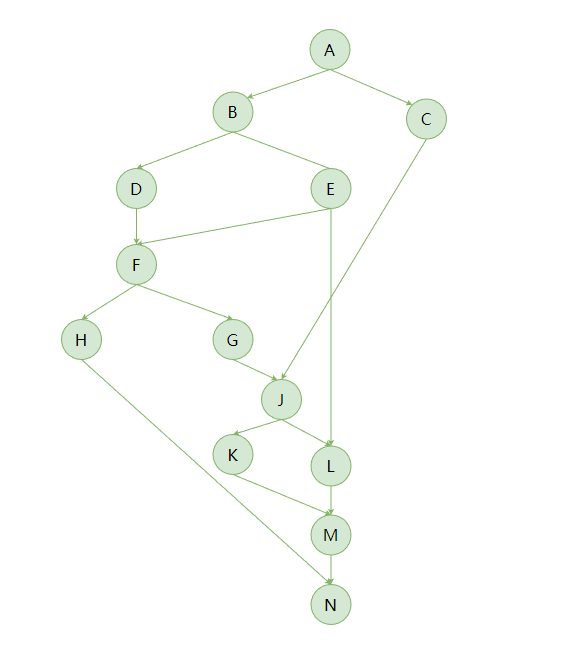

# Hello Easy Flows

> https://github.com/j-easy/easy-flows


## DAG



```sh
$ mvn test -D test=org.feuyeux.workflow.TestDag#testDagAndFlow

03:15:35.779 [[NWork], [MWork], [KWork, LWork], [JWork], [HWork, GWork], [FWork], [DWork, EWork], [BWork, CWork], [AWork]]
03:15:35.785  AWork:COMPLETED
03:15:35.787  BWork:COMPLETED
03:15:35.787  CWork:COMPLETED
03:15:35.787  DWork:COMPLETED
03:15:35.787  EWork:COMPLETED
03:15:35.788  FWork:COMPLETED
03:15:35.788  HWork:COMPLETED
03:15:35.788  GWork:COMPLETED
03:15:35.788  JWork:COMPLETED
03:15:35.789  KWork:COMPLETED
03:15:35.789  LWork:COMPLETED
03:15:35.789  MWork:COMPLETED
03:15:35.789  NWork:COMPLETED
03:15:35.789 Latest status:COMPLETED
```