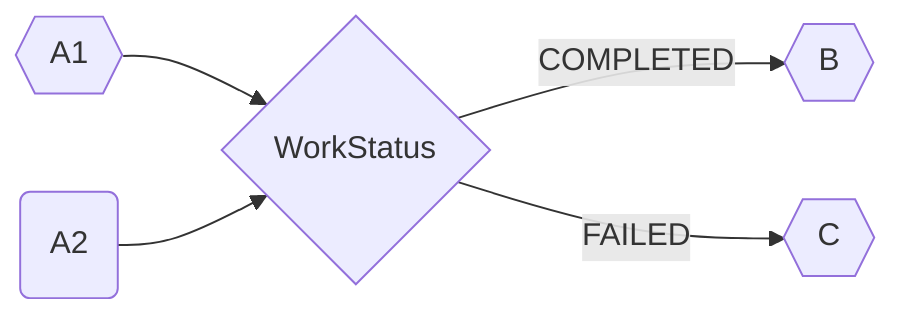

# Hello Easy Flows

## 1 TEMPLATE YAML -> DAG -> FLOW

### TEMPLATE YAML

```yaml
workflow:
  components:
    - name: A
      dependency:
    - name: S
      dependency: A
      union: S
    - name: T
      dependency: S
      union: S
      end: true
    - name: B
      dependency: A
    - name: C
      dependency: A
    - name: E
      dependency: B
    - name: D
      dependency: B
    - name: F
      dependency: D,E
    - name: G
      dependency: F
    - name: H
      dependency: F
      union: H
    - name: J
      dependency: H,C
      union: H
    - name: L
      dependency: J,D
      union: H
      end: true
    - name: K
      dependency: J
      union: H
      end: true
    - name: M
      dependency: L,K,T
      union: M
    - name: N
      dependency: M
      union: M
    - name: P
      dependency: N
      union: M
    - name: Q
      dependency: P
      union: M
      end: true
    - name: R
      dependency: Q,G
```

### DAG

```sh
dag queue[levels:12,total:18]:
[[RWork(R)], [QWork(Q)], [PWork(P)], [NWork(N)], [MWork(M)], [LWork(L), KWork(K)], [JWork(J)], [GWork(G), HWork(H)], [FWork(F)], [EWork(E), DWork(D), TWork(T)], [BWork(B), CWork(C), SWork(S)], [AWork(A)]]
```

[](doc/dag.drawio.png)

### FLOW

```sh
dag flow[total:18]:
[<AWork(A)> |BWork(B)| |CWork(C)| [<SWork(S)> |TWork(T)|] |EWork(E)| |DWork(D)| <FWork(F)> |GWork(G)| [<HWork(H)> <JWork(J)> |LWork(L)|] |KWork(K)|] [<MWork(M)> <NWork(N)> <PWork(P)> <QWork(Q)>] <RWork(R)>
```

### UT

```sh
$ mvn test -D test=org.feuyeux.workflow.dag.TestAll#testOne

11:25:11.977 dag queue[levels:12,total:18]:
[[RWork(R)], [QWork(Q)], [PWork(P)], [NWork(N)], [MWork(M)], [LWork(L), KWork(K)], [JWork(J)], [GWork(G), HWork(H)], [FWork(F)], [EWork(E), DWork(D), TWork(T)], [BWork(B), CWork(C), SWork(S)], [AWork(A)]]
11:25:11.984 dag flow[total:18]:
[<AWork(A)> |BWork(B)| |CWork(C)| [<SWork(S)> |TWork(T)|] |EWork(E)| |DWork(D)| <FWork(F)> |GWork(G)| [<HWork(H)> <JWork(J)> |LWork(L)|] |KWork(K)|] [<MWork(M)> <NWork(N)> <PWork(P)> <QWork(Q)>] <RWork(R)> 
11:25:11.987 a8c0a8e3-1b48-4880-b06f-e1ba4216de3d AWork(A):COMPLETED
11:25:11.988 a8c0a8e3-1b48-4880-b06f-e1ba4216de3d BWork(B):COMPLETED
11:25:11.989 a8c0a8e3-1b48-4880-b06f-e1ba4216de3d CWork(C):COMPLETED
11:25:11.989 a8c0a8e3-1b48-4880-b06f-e1ba4216de3d SWork(S):COMPLETED
11:25:11.989 a8c0a8e3-1b48-4880-b06f-e1ba4216de3d TWork(T):COMPLETED
11:25:11.990 a8c0a8e3-1b48-4880-b06f-e1ba4216de3d EWork(E):COMPLETED
11:25:11.990 a8c0a8e3-1b48-4880-b06f-e1ba4216de3d DWork(D):COMPLETED
11:25:11.990 a8c0a8e3-1b48-4880-b06f-e1ba4216de3d FWork(F):COMPLETED
11:25:11.991 a8c0a8e3-1b48-4880-b06f-e1ba4216de3d GWork(G):COMPLETED
11:25:11.991 a8c0a8e3-1b48-4880-b06f-e1ba4216de3d HWork(H):COMPLETED
11:25:11.991 a8c0a8e3-1b48-4880-b06f-e1ba4216de3d JWork(J):COMPLETED
11:25:11.992 a8c0a8e3-1b48-4880-b06f-e1ba4216de3d KWork(K):COMPLETED
11:25:11.992 a8c0a8e3-1b48-4880-b06f-e1ba4216de3d LWork(L):COMPLETED
11:25:11.992 a8c0a8e3-1b48-4880-b06f-e1ba4216de3d MWork(M):COMPLETED
11:25:11.992 a8c0a8e3-1b48-4880-b06f-e1ba4216de3d NWork(N):COMPLETED
11:25:11.992 a8c0a8e3-1b48-4880-b06f-e1ba4216de3d PWork(P):COMPLETED
11:25:11.992 a8c0a8e3-1b48-4880-b06f-e1ba4216de3d QWork(Q):COMPLETED
11:25:11.992 a8c0a8e3-1b48-4880-b06f-e1ba4216de3d RWork(R):COMPLETED
```

## 2 FLOW & CONFIG



><https://mermaid.js.org/config/theming.html#theme-variables>

```java
ConditionalFlow conditionalFlow = ConditionalFlow.Builder.aNewConditionalFlow()
                .named("conditional_flow")
                .execute(buildParallelFlow(a1,a2))
                .when(WorkReportPredicate.COMPLETED)
                .then(b)
                .otherwise(c)
                .build();
```

```sh
20:18:21.595 A1 will work 100ms...
20:18:21.595 A2 will work 1000ms...
20:18:21.698 A1 COMPLETED
20:18:22.599 A2 COMPLETED
20:18:22.600 B will work 200ms...
20:18:22.805 B COMPLETED
20:18:22.805 latest flow status:COMPLETED
20:18:22.805 --------------------
20:18:22.806 A1 will work 100ms...
20:18:22.807 A2 will work 1000ms...
20:18:22.911 A1 COMPLETED
20:18:23.812 A2 FAILED
20:18:23.813 C will work 200ms...
20:18:24.018 C COMPLETED
20:18:24.018 latest flow status:COMPLETED
```

## Dependence

[j-easy easy-flows](https://github.com/j-easy/easy-flows)


