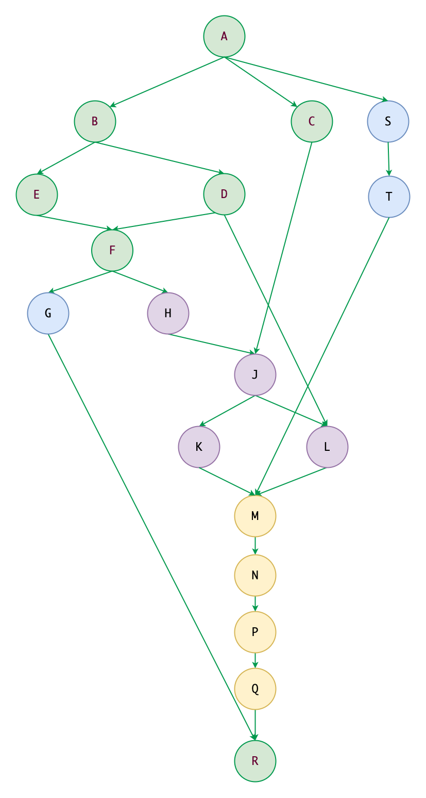

# Hello Easy Flows

> https://github.com/j-easy/easy-flows

**template yaml -> dag -> flow**


## DAG

| YAML                                                                       | DAG  |
|:---------------------------------------------------------------------------| :----- |
|  |      |

```sh
$ mvn test -D test=org.feuyeux.workflow.TestDag#testDagAndFlow

18:15:23.594 queue[levels:9,total:13]:[[NWork(NWork)], [MWork(MWork)], [KWork(KWork), LWork(LWork)], [JWork(JWork)], [HWork(HWork), GWork(GWork)], [FWork(FWork)], [EWork(EWork), DWork(DWork)], [BWork(BWork), CWork(CWork)], [AWork(AWork)]]
18:15:23.601  AWork(AWork):COMPLETED
18:15:23.603  CWork(CWork):COMPLETED
18:15:23.603  BWork(BWork):COMPLETED
18:15:23.604  EWork(EWork):COMPLETED
18:15:23.604  DWork(DWork):COMPLETED
18:15:23.605  FWork(FWork):COMPLETED
18:15:23.605  HWork(HWork):COMPLETED
18:15:23.605  GWork(GWork):COMPLETED
18:15:23.606  JWork(JWork):COMPLETED
18:15:23.606  KWork(KWork):COMPLETED
18:15:23.606  LWork(LWork):COMPLETED
18:15:23.607  MWork(MWork):COMPLETED
18:15:23.607  NWork(NWork):COMPLETED
18:15:23.607 Latest status:COMPLETED
[INFO] Tests run: 1, Failures: 0, Errors: 0, Skipped: 0, Time elapsed: 2.943 s -- in org.feuyeux.workflow.TestDag
```