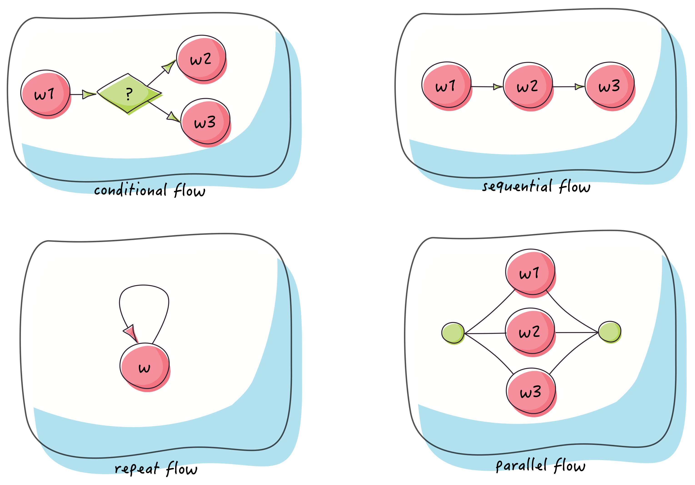

# Hello Easy Flows

> https://github.com/j-easy/easy-flows



## DAG


```sh
$ mvn test -D test=org.feuyeux.workflow.TestDag#test

17:07:11.914 AWork:COMPLETED
17:07:11.915 BWork:COMPLETED
17:07:11.915 CWork:COMPLETED
17:07:11.916 EWork:COMPLETED
17:07:11.916 FWork:COMPLETED
17:07:11.917 HWork:COMPLETED
17:07:11.917 GWork:COMPLETED
17:07:11.917 IWork:COMPLETED
17:07:11.917 latest flow status:COMPLETED
```